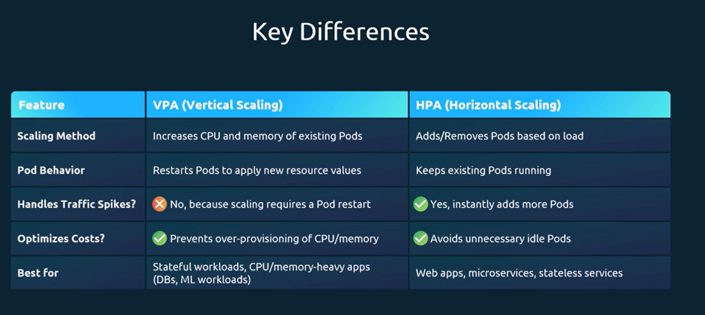

# Vertical Pod Autoscaling
## Monitor pod resources
```bash
controlplane ~ ➜  kubectl top pod
NAME                         CPU(cores)   MEMORY(bytes)   
flask-app-4-668b99c9-mzfxh   1m           19Mi            
flask-app-4-668b99c9-zlmcs   1m           19Mi         
```
## Get info vpa
```bash
controlplane ~ ➜  kubectl get vpa
NAME        MODE   CPU   MEM   PROVIDED   AGE
flask-app   Off                           8s
```
## 
```bash

```
## 
```bash

```


